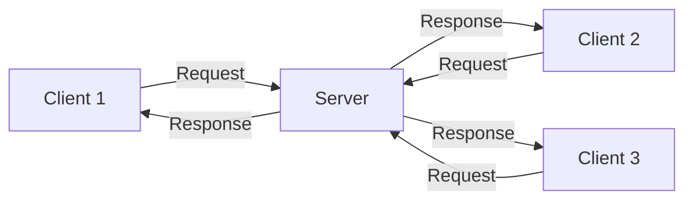
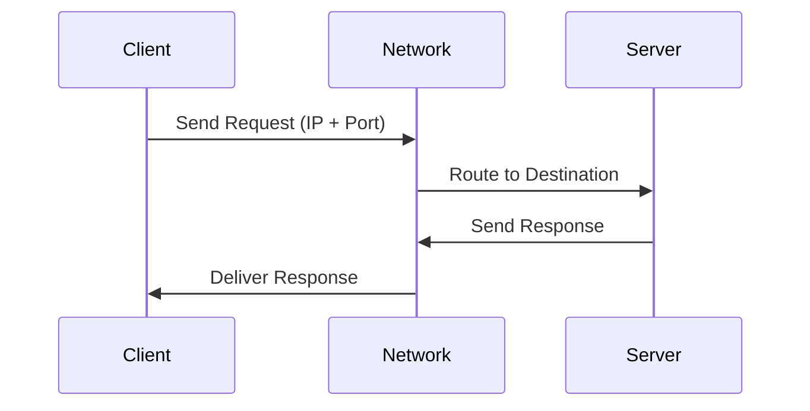
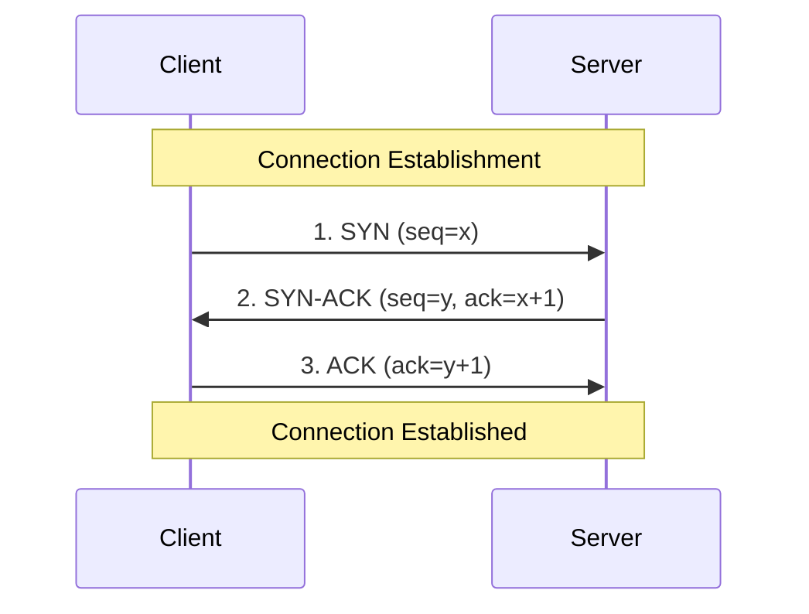
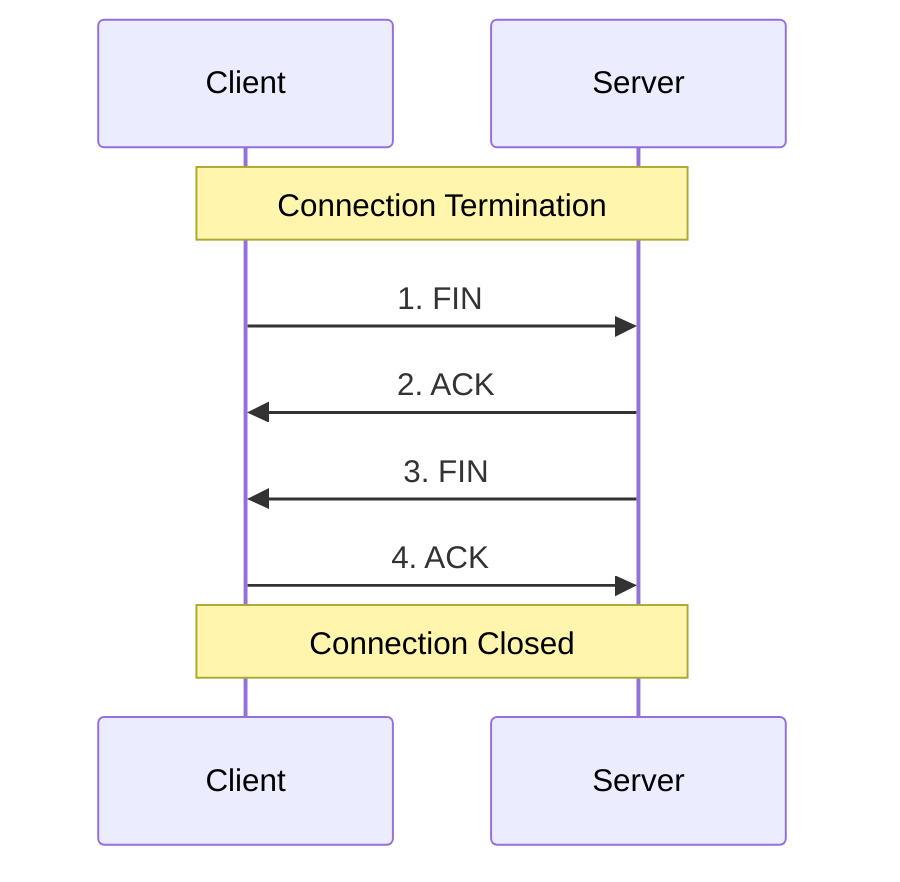
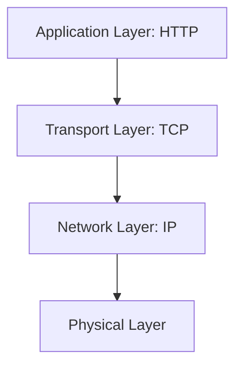
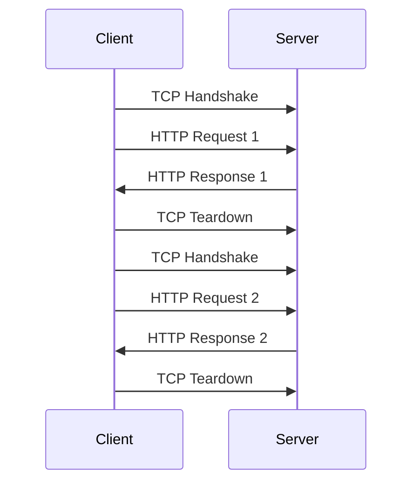
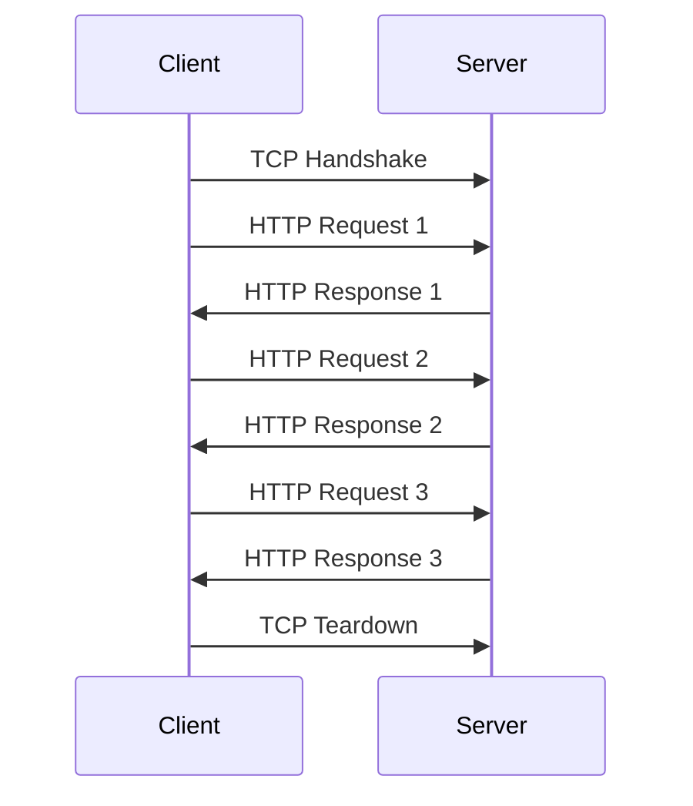
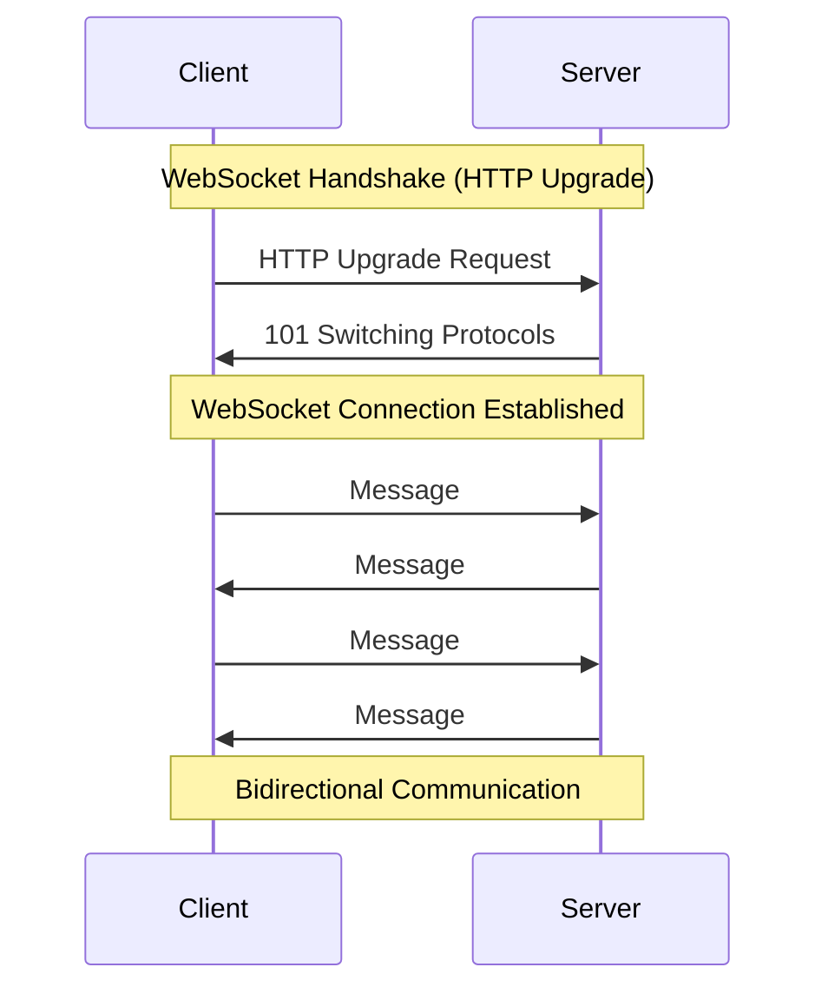
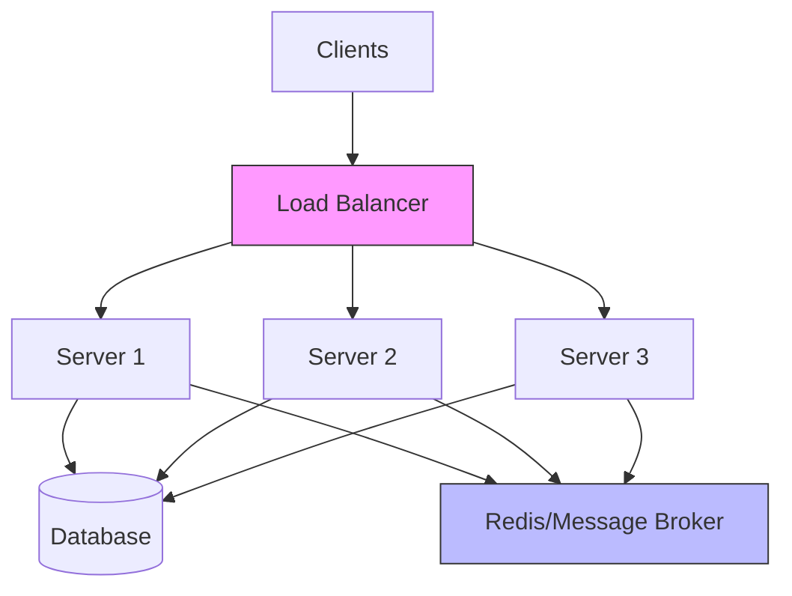

# Client-Server Model

## What is Client-Server Model?

A distributed architecture where **clients** request services/resources and **servers** provide them. Clients initiate communication, servers respond.

**Key Characteristics:**
- Clear separation of concerns
- Centralized control and data management
- Scalable through server replication
- Clients are typically user-facing, servers handle business logic



## How Communication Happens

Communication occurs through **sockets** - endpoints for sending/receiving data over a network.



**Process:**
1. Client opens socket connection to server's IP address and port
2. Data sent in packets across network layers
3. Server processes request and sends response back
4. Connection may persist or close based on protocol

## Network Protocols: TCP vs UDP

### TCP (Transmission Control Protocol)
- **Connection-oriented**: Establishes connection before data transfer
- **Reliable**: Guarantees delivery and order
- **Error checking**: Detects and retransmits lost packets
- **Flow control**: Manages data transmission rate
- **Use cases**: HTTP, FTP, Email, Database connections

### UDP (User Datagram Protocol)
- **Connectionless**: No handshake, sends data immediately
- **Unreliable**: No delivery guarantee
- **Fast**: Lower overhead, no acknowledgments
- **Use cases**: Video streaming, gaming, DNS, VoIP

**Trade-off**: TCP prioritizes reliability, UDP prioritizes speed.

## TCP Protocol Deep Dive

### Three-Way Handshake (Connection Establishment)



**Steps:**
1. **SYN**: Client sends synchronization packet with initial sequence number
2. **SYN-ACK**: Server acknowledges and sends its own sequence number
3. **ACK**: Client acknowledges server's sequence number

**Why needed?** Synchronizes sequence numbers for reliable, ordered data transfer.

### Four-Way Teardown (Connection Termination)



**Steps:**
1. **FIN**: Client signals it's done sending data
2. **ACK**: Server acknowledges
3. **FIN**: Server signals it's done
4. **ACK**: Client acknowledges

**Why four-way?** Allows both sides to finish sending remaining data gracefully (full-duplex closure).

## HTTP - Protocol Over TCP

### What is HTTP?

**HyperText Transfer Protocol** - Application layer protocol for transferring hypermedia documents. Runs on top of TCP (usually port 80 for HTTP, 443 for HTTPS).



**Request-Response Model:**
```
Client → HTTP Request → Server
Server → HTTP Response → Client
```

### Properties of HTTP/1.1

1. **Stateless**: Each request is independent, no session memory
2. **Persistent Connections**: Keep-Alive enabled by default
3. **Pipelining**: Multiple requests without waiting for responses
4. **Chunked Transfer Encoding**: Stream data in chunks
5. **Host Header**: Support for virtual hosting (multiple domains on one IP)
6. **Caching**: Enhanced cache control headers

## Keep-Alive Header

### What is Keep-Alive?

Allows TCP connection to remain open for multiple HTTP requests/responses instead of opening a new connection each time.

**Without Keep-Alive (HTTP/1.0 default):**


**With Keep-Alive (HTTP/1.1 default):**


### Header Syntax

**Request:**
```
Connection: keep-alive
Keep-Alive: timeout=5, max=100
```

**Response:**
```
Connection: keep-alive
Keep-Alive: timeout=5, max=100
```

**Parameters:**
- `timeout`: Seconds connection stays open idle (default: varies by server)
- `max`: Maximum requests before closing connection

### Benefits
- Reduced latency (no repeated handshakes)
- Less CPU usage (fewer connections)
- Better throughput for multiple requests
- Reduced network congestion

### Trade-offs
- Server resources held longer (memory for open connections)
- Need connection pooling management
- Idle connections consume resources

## WebSocket

### What is WebSocket?

**Full-duplex** communication protocol over a single TCP connection. Enables real-time, bidirectional data flow between client and server.



### WebSocket vs HTTP

| Feature | HTTP | WebSocket |
|---------|------|-----------|
| Communication | Request-Response | Full-duplex |
| Connection | Short-lived (or Keep-Alive) | Long-lived persistent |
| Overhead | Headers with each request | Small frames after handshake |
| Server Push | Not native (polling/SSE needed) | Native support |
| Use Case | REST APIs, page loads | Chat, gaming, live feeds |

### When to Use HTTP
- RESTful APIs
- CRUD operations
- Request-response patterns
- Stateless interactions
- SEO-important content
- Simple data fetching

### When to Use WebSocket
- Real-time chat applications
- Live sports scores/stock tickers
- Multiplayer games
- Collaborative editing (Google Docs style)
- Live notifications
- IoT device communication

**Rule of thumb:** If server needs to push updates frequently or bidirectional communication is needed, use WebSocket. Otherwise, HTTP is simpler.

## Code Examples

### WebSocket with Socket.io

**Server (Node.js):**
```javascript
const express = require('express');
const http = require('http');
const socketIo = require('socket.io');

const app = express();
const server = http.createServer(app);
const io = socketIo(server);

// Handle WebSocket connections
io.on('connection', (socket) => {
  console.log('New client connected:', socket.id);
  
  // Listen for messages from client
  socket.on('message', (data) => {
    console.log('Received:', data);
    
    // Send message back to client
    socket.emit('response', { 
      text: `Server received: ${data}` 
    });
    
    // Broadcast to all clients
    io.emit('broadcast', { 
      from: socket.id, 
      message: data 
    });
  });
  
  // Handle custom events
  socket.on('join-room', (room) => {
    socket.join(room);
    io.to(room).emit('user-joined', socket.id);
  });
  
  // Handle disconnection
  socket.on('disconnect', () => {
    console.log('Client disconnected:', socket.id);
  });
});

server.listen(3000, () => {
  console.log('WebSocket server on port 3000');
});
```

**Client (Browser):**
```javascript
const socket = io('http://localhost:3000');

// Connect event
socket.on('connect', () => {
  console.log('Connected to server');
  
  // Send message to server
  socket.emit('message', 'Hello from client!');
});

// Listen for responses
socket.on('response', (data) => {
  console.log('Server response:', data);
});

// Listen for broadcasts
socket.on('broadcast', (data) => {
  console.log('Broadcast:', data);
});

// Join a room
socket.emit('join-room', 'room1');

// Handle disconnection
socket.on('disconnect', () => {
  console.log('Disconnected from server');
});
```

### HTTP with Express

**Server:**
```javascript
const express = require('express');
const app = express();

// Middleware to parse JSON
app.use(express.json());

// GET request
app.get('/api/users', (req, res) => {
  res.json({ 
    users: [
      { id: 1, name: 'Alice' },
      { id: 2, name: 'Bob' }
    ]
  });
});

// POST request
app.post('/api/users', (req, res) => {
  const { name } = req.body;
  res.status(201).json({ 
    id: 3, 
    name,
    message: 'User created' 
  });
});

// Query parameters
app.get('/api/search', (req, res) => {
  const { q, limit } = req.query;
  res.json({ 
    query: q, 
    limit: limit || 10 
  });
});

// Route parameters
app.get('/api/users/:id', (req, res) => {
  const { id } = req.params;
  res.json({ 
    id, 
    name: 'User ' + id 
  });
});

app.listen(3000, () => {
  console.log('HTTP server on port 3000');
});
```

### HTTP with Plain Node.js

**Server:**
```javascript
const http = require('http');
const url = require('url');

const server = http.createServer((req, res) => {
  const parsedUrl = url.parse(req.url, true);
  const path = parsedUrl.pathname;
  const method = req.method;
  
  // Set CORS headers
  res.setHeader('Access-Control-Allow-Origin', '*');
  res.setHeader('Content-Type', 'application/json');
  
  // Handle GET request
  if (method === 'GET' && path === '/api/users') {
    res.statusCode = 200;
    res.end(JSON.stringify({ 
      users: [
        { id: 1, name: 'Alice' },
        { id: 2, name: 'Bob' }
      ]
    }));
  }
  
  // Handle POST request
  else if (method === 'POST' && path === '/api/users') {
    let body = '';
    
    req.on('data', chunk => {
      body += chunk.toString();
    });
    
    req.on('end', () => {
      const data = JSON.parse(body);
      res.statusCode = 201;
      res.end(JSON.stringify({ 
        id: 3, 
        name: data.name,
        message: 'User created'
      }));
    });
  }
  
  // Handle 404
  else {
    res.statusCode = 404;
    res.end(JSON.stringify({ 
      error: 'Not Found' 
    }));
  }
});

server.listen(3000, () => {
  console.log('HTTP server on port 3000');
});
```

**Client (Making HTTP Requests):**
```javascript
const http = require('http');

// GET request
const getOptions = {
  hostname: 'localhost',
  port: 3000,
  path: '/api/users',
  method: 'GET'
};

const getReq = http.request(getOptions, (res) => {
  let data = '';
  
  res.on('data', chunk => {
    data += chunk;
  });
  
  res.on('end', () => {
    console.log('Response:', JSON.parse(data));
  });
});

getReq.on('error', (error) => {
  console.error('Error:', error);
});

getReq.end();

// POST request
const postData = JSON.stringify({ name: 'Charlie' });

const postOptions = {
  hostname: 'localhost',
  port: 3000,
  path: '/api/users',
  method: 'POST',
  headers: {
    'Content-Type': 'application/json',
    'Content-Length': Buffer.byteLength(postData)
  }
};

const postReq = http.request(postOptions, (res) => {
  let data = '';
  
  res.on('data', chunk => {
    data += chunk;
  });
  
  res.on('end', () => {
    console.log('Response:', JSON.parse(data));
  });
});

postReq.on('error', (error) => {
  console.error('Error:', error);
});

postReq.write(postData);
postReq.end();
```

## System Design Considerations

### Scalability
- **Load Balancing**: Distribute HTTP requests across multiple servers
- **Connection Pooling**: Reuse TCP connections efficiently
- **WebSocket Scaling**: Need sticky sessions or message brokers (Redis Pub/Sub)

### Performance
- **HTTP Keep-Alive**: Reduce handshake overhead
- **HTTP/2**: Multiplexing, header compression
- **WebSocket**: Lower latency for real-time features

### Trade-offs
- **HTTP**: Simpler, stateless, easier to scale horizontally
- **WebSocket**: Complex state management, sticky sessions, harder to load balance

### Real-world Architecture



For WebSocket at scale, use message brokers to synchronize state across server instances.