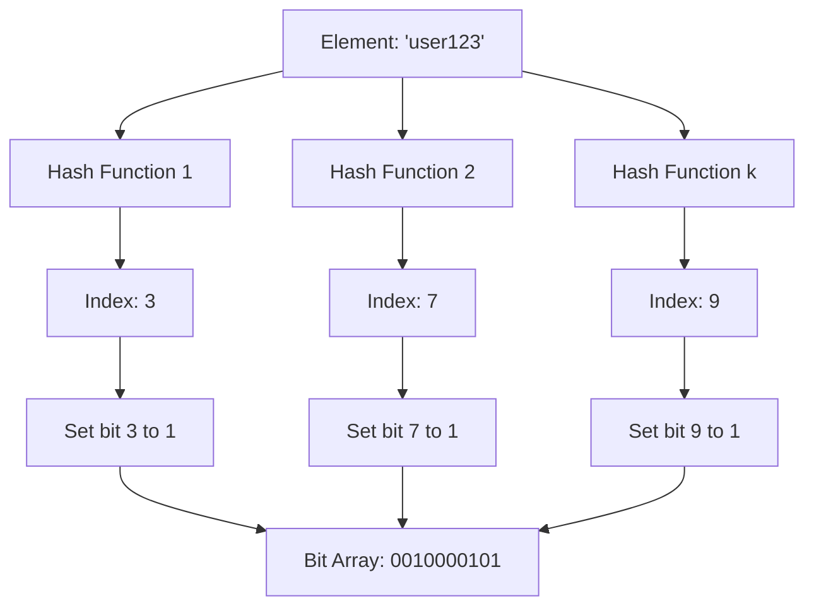
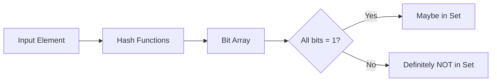
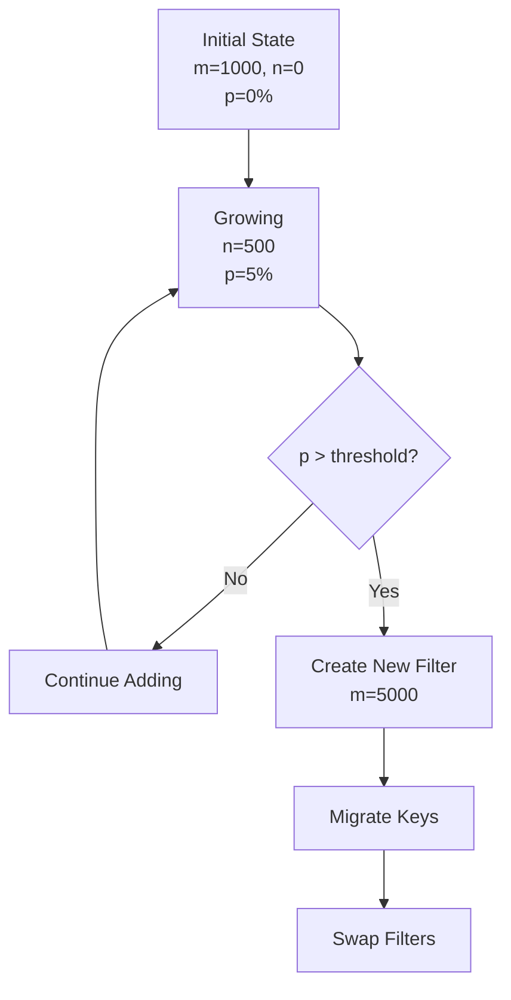

# Bloom Filter - System Design Guide

## What is a Bloom Filter?

A **Bloom Filter** is a probabilistic, space-efficient data structure used to test whether an element is a member of a set. It can definitively tell you if an element is **NOT** in the set, but can only tell you if an element is **POSSIBLY** in the set (with some probability of false positives).

### Core Concept: Bit Array

At its heart, a Bloom Filter uses:
- A **bit array** of size `m` (all bits initially set to 0)
- `k` different **hash functions** that map elements to positions in the bit array

```
Bit Array Example (size = 10):
[0, 0, 0, 0, 0, 0, 0, 0, 0, 0]
```

## How It Works

### Adding an Element
1. Pass the element through `k` hash functions
2. Each hash function produces an index in the bit array
3. Set those bits to 1

### Checking Membership
1. Pass the element through the same `k` hash functions
2. Check if ALL corresponding bits are 1
   - If any bit is 0 → **Definitely NOT in set**
   - If all bits are 1 → **Probably in set** (could be false positive)



## Architecture & Components

### Basic Structure



### Key Components
1. **Bit Array**: Fixed-size array of bits (typically in memory)
2. **Hash Functions**: Independent hash functions (k functions)
3. **Operations**: Add and Query (no deletion in standard Bloom Filter)

## False Positive Rate

### Why False Positives Occur
As more elements are added, more bits are set to 1. Eventually, a query for an element that was never added might find all its hashed positions already set to 1 by other elements.

```
Example:
- Add "alice" → sets bits [2, 5, 8]
- Add "bob" → sets bits [5, 7, 9]
- Query "charlie" → hashes to [2, 7, 9] → all are 1 → FALSE POSITIVE!
```

### Mathematical Formula

The false positive probability `p` is approximately:

```
p ≈ (1 - e^(-kn/m))^k

Where:
- k = number of hash functions
- n = number of elements inserted
- m = size of bit array
- e = Euler's number (≈ 2.718)
```

### Optimal Number of Hash Functions

```
k = (m/n) * ln(2)

Where ln(2) ≈ 0.693
```

### As More Elements Added

**Key Insight**: As `n` increases, false positive rate increases exponentially!

```
n = 100,  m = 1000, k = 7 → p ≈ 0.82%
n = 500,  m = 1000, k = 7 → p ≈ 39.3%
n = 1000, m = 1000, k = 7 → p ≈ 95.2%
```

## How to Overcome High False Positive Rate

### Solution 1: Increase Bit Array Size
```
If false positive rate is too high:
1. Create a NEW Bloom Filter with larger size (larger m)
2. Re-populate ALL existing keys into the new filter
3. Replace the old filter with the new one
```

**Problem**: Requires knowing all previous keys or rebuilding from source data.

### Solution 2: Provision Large Size Upfront
```
Best Practice:
1. Estimate maximum expected keys (n_max)
2. Choose acceptable false positive rate (p_target)
3. Calculate required m and k
4. Provision with buffer (e.g., 1.5x estimated)

Formula for required bits:
m = -(n * ln(p)) / (ln(2))^2

Example:
n_max = 1,000,000
p_target = 0.01 (1%)
m ≈ 9,585,059 bits ≈ 1.2 MB
```

## Trade-offs

### Advantages
✓ **Space Efficient**: Much smaller than storing actual elements
✓ **Fast**: O(k) time for both insert and query
✓ **Fixed Memory**: Size doesn't grow with elements (until rebuilding)
✓ **No False Negatives**: If it says "no", it's definitely not there

### Disadvantages
✗ **False Positives**: Can say "yes" when element is not present
✗ **No Deletion**: Standard Bloom Filters don't support removal
✗ **No Element Retrieval**: Can't list what's stored
✗ **Rebuild Required**: Need to recreate if false positive rate becomes unacceptable

## Design Decisions & Considerations

### When to Use Bloom Filter
- You need to **filter out** definitely non-existent items
- You can tolerate **false positives** (not false negatives)
- You need **space efficiency** over certainty
- You only need **add and query** operations (no deletion)
- The cost of false positives is **lower than the cost of always checking**

### When NOT to Use
- You need **100% accuracy**
- You need to **delete elements**
- False positives are **unacceptable**
- Memory is not a constraint

## Practical Applications

### 1. Medium Article Recommendations
```
Problem: Don't show articles user has already read

Solution:
- Store article IDs user has read in Bloom Filter
- Before showing article → query Bloom Filter
- If "definitely not read" → show article
- If "maybe read" → check database (rare)

Benefit: Avoid 99% of database queries
```

### 2. Web Crawler - Avoiding Duplicate URLs
```
Problem: Prevent crawling same URL twice

Solution:
- Add crawled URLs to Bloom Filter
- Before crawling → check Bloom Filter
- If "definitely not crawled" → crawl URL
- If "maybe crawled" → skip or double-check

Benefit: Save billions of duplicate crawl attempts
```

### 3. Feed Generation (Twitter, Instagram, LinkedIn)
```
Problem: Don't show posts user has already seen

Solution:
- Maintain Bloom Filter per user session
- Add shown post IDs to filter
- Query before showing next batch
- Reset filter after session or periodically

Benefit: Reduce database lookups by 95%+
```

### 4. Tinder Feed
```
Problem: Don't show profiles user has swiped on

Solution:
- Store swiped profile IDs in Bloom Filter
- Check before showing profile
- Occasional false positive → user sees profile again (acceptable)

Benefit: Significant memory savings vs storing all IDs
```

### 5. Database Query Optimization
```
Problem: Check if value exists before expensive disk read

Solution:
- Maintain Bloom Filter in memory for disk-based data
- Query filter first
- Only hit disk if "maybe exists"

Benefit: Avoid unnecessary disk I/O
```

## Bloom Filter in Redis

### RedisBloom Module

Redis supports Bloom Filters through the **RedisBloom** module.

#### Key Commands
```bash
# Add element
BF.ADD key item

# Check existence
BF.EXISTS key item

# Create with custom parameters
BF.RESERVE key error_rate capacity

# Add multiple
BF.MADD key item1 item2 item3

# Check multiple
BF.MEXISTS key item1 item2 item3
```

#### Example
```bash
# Create Bloom Filter with 1% error rate and 1000 capacity
BF.RESERVE users:seen 0.01 1000

# Add users
BF.ADD users:seen "user_123"
BF.ADD users:seen "user_456"

# Check existence
BF.EXISTS users:seen "user_123"  # Returns 1 (exists)
BF.EXISTS users:seen "user_999"  # Returns 0 (doesn't exist)
```

## Libraries for Different Languages

### Python
```python
# Using pybloom_live
from pybloom_live import BloomFilter

bf = BloomFilter(capacity=1000, error_rate=0.01)
bf.add("item1")
"item1" in bf  # True
"item2" in bf  # False
```

### Java
```java
// Using Google Guava
BloomFilter<String> bf = BloomFilter.create(
    Funnels.stringFunnel(Charsets.UTF_8),
    1000,  // expected insertions
    0.01   // false positive rate
);
bf.put("item1");
bf.mightContain("item1");  // true
```

### JavaScript/Node.js
```javascript
// Using bloom-filters
const { BloomFilter } = require('bloom-filters');

const filter = new BloomFilter(1000, 0.01);
filter.add('item1');
filter.has('item1');  // true
```

### Go
```go
// Using boom filter
import "github.com/tylertreat/BoomFilters"

bf := boom.NewBloomFilter(1000, 0.01)
bf.Add([]byte("item1"))
bf.Test([]byte("item1"))  // true
```

## Scalability Considerations



### Scaling Strategy
1. **Monitor**: Track false positive rate
2. **Threshold**: Set acceptable limit (e.g., 5%)
3. **Pre-allocate**: Start with large filter based on estimates
4. **Rebuild**: When threshold exceeded, create larger filter
5. **Distributed**: Use multiple Bloom Filters (sharding)

## Exercise: Hands-on with Redis Bloom Filter

### Setup Redis Locally

#### 1. Install Redis with RedisBloom
```bash
# Using Docker (easiest)
docker run -d -p 6379:6379 redis/redis-stack-server:latest

# Or install Redis and RedisBloom module separately
# Download RedisBloom from: https://redis.io/docs/stack/bloom/
```

#### 2. Connect to Redis
```bash
redis-cli
```

### Code Example & Exploration

#### Python Example
```python
import redis
from redis.commands.bf import BFCommands

# Connect to Redis
r = redis.Redis(host='localhost', port=6379, decode_responses=True)
bf = r.bf()

# Create a Bloom Filter
# capacity: 10000, error_rate: 0.01 (1%)
bf.create("email_filter", 0.01, 10000)

# Add emails
emails = [
    "alice@example.com",
    "bob@example.com",
    "charlie@example.com",
    "dave@example.com",
    "eve@example.com"
]

for email in emails:
    bf.add("email_filter", email)
    print(f"Added: {email}")

# Check existence
print("\n--- Checking Existence ---")
print(f"alice@example.com exists: {bf.exists('email_filter', 'alice@example.com')}")
print(f"xyz@example.com exists: {bf.exists('email_filter', 'xyz@example.com')}")

# Try to find false positives
print("\n--- Testing for False Positives ---")
false_positive_count = 0
test_emails = [f"test{i}@example.com" for i in range(1000)]

for email in test_emails:
    if bf.exists("email_filter", email):
        print(f"FALSE POSITIVE: {email}")
        false_positive_count += 1

print(f"\nFalse Positives: {false_positive_count} out of {len(test_emails)}")
print(f"False Positive Rate: {false_positive_count/len(test_emails)*100:.2f}%")
```

#### Expected Output
```
Added: alice@example.com
Added: bob@example.com
Added: charlie@example.com
Added: dave@example.com
Added: eve@example.com

--- Checking Existence ---
alice@example.com exists: True
xyz@example.com exists: False

--- Testing for False Positives ---
FALSE POSITIVE: test47@example.com
FALSE POSITIVE: test234@example.com
FALSE POSITIVE: test567@example.com
FALSE POSITIVE: test789@example.com

False Positives: 4 out of 1000
False Positive Rate: 0.40%
```

### Getting a False Positive (Deterministic)

```python
import redis
from redis.commands.bf import BFCommands

r = redis.Redis(host='localhost', port=6379, decode_responses=True)
bf = r.bf()

# Create small Bloom Filter for higher collision chance
bf.create("small_filter", 0.1, 10)  # 10% error rate, 10 capacity

# Add items
items_to_add = ["apple", "banana", "cherry", "date", "elderberry"]
for item in items_to_add:
    bf.add("small_filter", item)

# Test many items to find false positive
print("Testing for false positives...")
test_items = ["fig", "grape", "kiwi", "lemon", "mango", "orange", 
              "peach", "pear", "plum", "strawberry", "watermelon"]

for item in test_items:
    result = bf.exists("small_filter", item)
    if result:
        print(f"✗ FALSE POSITIVE found: '{item}' (was never added!)")
    else:
        print(f"✓ Correctly identified '{item}' as not present")
```

#### Expected Output
```
Testing for false positives...
✓ Correctly identified 'fig' as not present
✗ FALSE POSITIVE found: 'grape' (was never added!)
✓ Correctly identified 'kiwi' as not present
✓ Correctly identified 'lemon' as not present
✗ FALSE POSITIVE found: 'mango' (was never added!)
...
```

### Redis Bloom Filter Documentation
Official docs: [https://redis.io/docs/stack/bloom/](https://redis.io/docs/stack/bloom/)

Key commands to explore:
- `BF.RESERVE` - Create with custom parameters
- `BF.ADD` / `BF.MADD` - Add single/multiple items
- `BF.EXISTS` / `BF.MEXISTS` - Check single/multiple items
- `BF.INFO` - Get filter statistics

---

## Quick Interview Cheat Sheet

**Q: When to use Bloom Filter?**  
A: When you need space-efficient membership testing, can tolerate false positives, and only need add/query operations.

**Q: What's the main limitation?**  
A: False positives increase as more items are added; no deletion support.

**Q: How to handle growing false positive rate?**  
A: Recreate with larger size and repopulate, or provision large filter upfront based on estimates.

**Q: Real-world example?**  
A: Web crawlers use it to avoid re-crawling URLs, saving billions of duplicate checks.

**Q: Time complexity?**  
A: O(k) for both insert and query, where k is number of hash functions.

**Q: Can you get false negatives?**  
A: No! If Bloom Filter says "no", element is definitely not in the set.