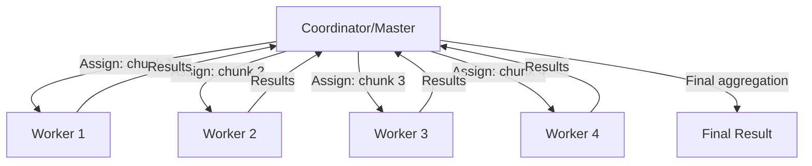
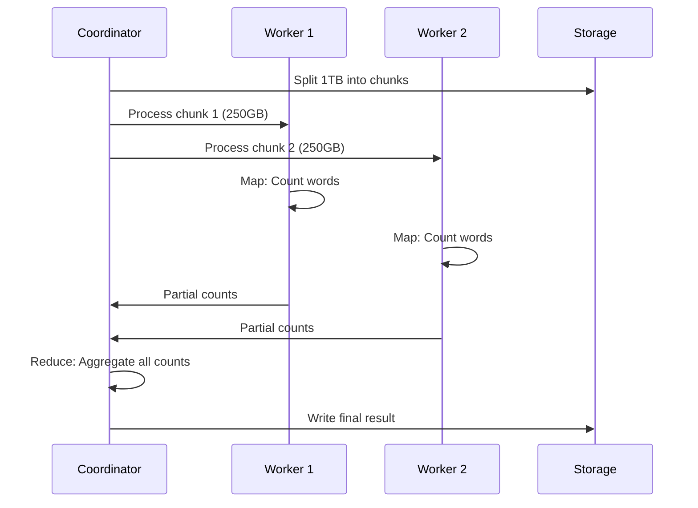
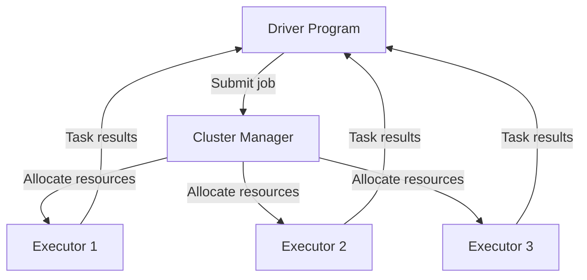

# Big Data Processing - System Design Guide

## What is Big Data Processing?

Big data processing is the methodology of handling and analyzing massive datasets that cannot be efficiently processed using traditional single-machine approaches. It involves distributed computing frameworks that split data across multiple machines to process in parallel.

**Key characteristics:**
- Volume: Terabytes to petabytes of data
- Velocity: High-speed data generation and processing
- Variety: Structured, semi-structured, and unstructured data

## Why Use Big Data Processing?

Traditional single-machine approaches fail when:
- Dataset exceeds memory capacity (RAM)
- Processing time becomes impractical (hours/days)
- Disk I/O becomes bottleneck
- Need for real-time or near-real-time insights

**Benefits:**
- Horizontal scalability (add more machines)
- Fault tolerance and reliability
- Cost-effective using commodity hardware
- Parallel processing reduces time dramatically

## Commodity Hardware

Instead of expensive specialized servers, big data systems use:
- Standard off-the-shelf servers
- Regular hard drives (not enterprise-grade)
- Cost: $1000-5000 per machine vs $50,000+ for specialized hardware
- Philosophy: Handle failures through software, not hardware

## Example Problem: Word Count on 1TB Text Data

### Approach 1: Plain Traversal with HashMap

```
Read entire file → Store in HashMap → Count frequencies
```

**Issues:**
- 1TB cannot fit in memory (typical: 16-128GB RAM)
- Single machine disk I/O is slow
- Processing time: Days to weeks
- No fault tolerance

### Approach 2: Multi-threading

```
Split file → Multiple threads → Each with HashMap → Merge results
```

**Issues:**
- Still limited by single machine memory
- Thread contention and synchronization overhead
- Doesn't solve the fundamental scale problem

### Approach 3: Distributed Computing

Split data across multiple machines and process in parallel.



### Distributed Computing Flow



**Process:**
1. **Split**: Divide 1TB into smaller chunks (e.g., 100MB each)
2. **Distribute**: Send chunks to available workers
3. **Map**: Each worker counts words in its chunk
4. **Shuffle**: Group same words together
5. **Reduce**: Aggregate counts for each word
6. **Output**: Final word frequencies

## Challenges in Distributed Computing

### 1. Failures
- Worker nodes crash during processing
- Network partitions
- Disk failures

**Solution**: Replication and task reassignment

### 2. Recovery
- How to resume from failures?
- Which tasks need re-execution?

**Solution**: Checkpointing and task tracking

### 3. Completion Detection
- When are all tasks done?
- How to handle stragglers (slow workers)?

**Solution**: Heartbeat mechanisms, speculative execution

### 4. Scaling
- Adding more workers
- Load balancing across workers
- Optimal data partitioning

**Solution**: Dynamic resource allocation, data locality awareness

### 5. Data Distribution
- Moving data is expensive
- Network bandwidth limitations

**Solution**: "Move computation to data" principle

## Big Data Tools

Frameworks that handle the complexity of distributed processing, providing:
- Automatic data partitioning
- Fault tolerance mechanisms
- Resource management
- Job scheduling
- Data shuffling and aggregation

**Popular Tools:**
- Apache Spark
- Apache Flink
- Apache Hadoop MapReduce
- Apache Storm

## Apache Spark

**What it is:** Unified analytics engine for large-scale data processing with in-memory computation.

**Key Features:**
- In-memory processing (100x faster than MapReduce)
- Supports batch and streaming
- Rich APIs: Scala, Python, Java, R
- Built-in libraries: SQL, MLlib, GraphX

**Architecture:**



**Core Concepts:**
- **RDD** (Resilient Distributed Dataset): Immutable distributed collection
- **DataFrame/Dataset**: Structured data with schema
- **Transformations**: Lazy operations (map, filter, groupBy)
- **Actions**: Trigger execution (count, collect, save)

## Apache Flink

**What it is:** Stream-processing framework with true event-time processing and exactly-once semantics.

**Key Features:**
- Stream-first approach (batch is special case of streaming)
- Event-time processing with watermarks
- Low latency (milliseconds)
- Stateful computations with checkpoints

**Best for:**
- Real-time analytics
- Complex event processing
- Low-latency requirements

**Spark vs Flink:**
- Spark: Better for batch, machine learning, ad-hoc analysis
- Flink: Better for true streaming, low latency, event-driven apps

## Does Spark Handle All Business Logic?

**Yes and No:**

**Spark handles:**
- Data parallelization and distribution
- Fault tolerance and recovery
- Memory management
- Task scheduling
- Data shuffling

**You still write:**
- Business logic (transformations, aggregations, filters)
- Data flow pipeline
- Schema definitions
- Custom functions (UDFs)

**Example:**
```python
# You write this business logic
df.filter(col("age") > 18) \
  .groupBy("country") \
  .agg(avg("salary")) \
  .orderBy("salary", descending=True)
```

Spark handles *how* to distribute this across workers, but *what* to do is your logic.

## What Tasks Does the Tool Do?

### Automatic Handling:
1. **Data Partitioning**: Splits data across workers
2. **Task Scheduling**: Decides which worker runs which task
3. **Fault Recovery**: Re-executes failed tasks
4. **Memory Management**: Spills to disk if needed
5. **Network Communication**: Shuffles data between workers
6. **Resource Allocation**: Requests executors from cluster
7. **Monitoring**: Tracks job progress and metrics

### Developer Responsibilities:
1. Define data sources and sinks
2. Write transformation logic
3. Configure cluster resources
4. Optimize partitioning strategy
5. Handle data quality issues
6. Design schema and data models

## What to Worry About When Using Spark?

### 1. Data Skew
Uneven data distribution causing some workers to process more data.

**Solution:** Salting keys, custom partitioners

### 2. Memory Issues
- OOM errors from large shuffles
- Too much data cached

**Solution:** Tune memory configs, optimize transformations

### 3. Shuffle Operations
Expensive operations like groupBy, join

**Solution:** Broadcast small tables, reduce shuffle volume

### 4. Small Files Problem
Many small files slow down processing

**Solution:** Coalesce/repartition, compact files

### 5. Resource Configuration
- Number of executors
- Cores per executor
- Memory per executor

**Solution:** Benchmark and tune based on workload

### 6. Data Serialization
Inefficient serialization slows performance

**Solution:** Use Kryo serialization

## Practical Exercise

### Setup Spark Locally

```bash
# Install Spark
wget https://dlcdn.apache.org/spark/spark-3.5.0/spark-3.5.0-bin-hadoop3.tgz
tar xvf spark-3.5.0-bin-hadoop3.tgz
export SPARK_HOME=~/spark-3.5.0-bin-hadoop3
export PATH=$SPARK_HOME/bin:$PATH

# Verify installation
spark-shell --version
```

### Sample Dataset: Sales Data

```csv
order_id,customer_id,product_id,quantity,price,timestamp
1,C001,P100,2,29.99,2024-01-01T10:00:00
2,C002,P101,1,49.99,2024-01-01T10:15:00
3,C001,P102,5,15.99,2024-01-01T10:30:00
```

### Basic Spark Job: Sales Analysis

```python
from pyspark.sql import SparkSession
from pyspark.sql.functions import col, sum, count, avg

# Initialize Spark
spark = SparkSession.builder \
    .appName("SalesAnalysis") \
    .master("local[*]") \
    .getOrCreate()

# Read sales data
df = spark.read.csv("sales_data.csv", header=True, inferSchema=True)

# Analysis: Revenue by product
revenue_by_product = df.groupBy("product_id") \
    .agg(
        sum(col("quantity") * col("price")).alias("total_revenue"),
        count("order_id").alias("order_count"),
        avg("quantity").alias("avg_quantity")
    ) \
    .orderBy(col("total_revenue").desc())

# Write results
revenue_by_product.write.json("output/revenue_by_product")

spark.stop()
```

### Advanced: Kafka to Enriched JSON

**Scenario:** Read events from Kafka, enrich with database details, write as JSON files.

```python
from pyspark.sql import SparkSession
from pyspark.sql.functions import col, from_json, struct, to_json
from pyspark.sql.types import StructType, StringType, IntegerType
import psycopg2

# Initialize Spark with Kafka support
spark = SparkSession.builder \
    .appName("KafkaEnrichment") \
    .config("spark.jars.packages", "org.apache.spark:spark-sql-kafka-0-10_2.12:3.5.0") \
    .master("local[*]") \
    .getOrCreate()

# Define schema for Kafka messages
schema = StructType() \
    .add("event_id", StringType()) \
    .add("customer_id", StringType()) \
    .add("product_id", StringType()) \
    .add("timestamp", StringType())

# Read from Kafka
df = spark.readStream \
    .format("kafka") \
    .option("kafka.bootstrap.servers", "localhost:9092") \
    .option("subscribe", "sales-events") \
    .load()

# Parse JSON from Kafka
parsed_df = df.select(
    from_json(col("value").cast("string"), schema).alias("data")
).select("data.*")

# Enrichment function (broadcast for efficiency)
def enrich_with_db(batch_df, batch_id):
    # Connect to database
    conn = psycopg2.connect(
        host="localhost",
        database="sales_db",
        user="user",
        password="password"
    )
    
    # Collect customer_ids
    customer_ids = [row.customer_id for row in batch_df.select("customer_id").distinct().collect()]
    
    # Fetch customer details
    cursor = conn.cursor()
    cursor.execute(
        "SELECT customer_id, name, email, country FROM customers WHERE customer_id IN %s",
        (tuple(customer_ids),)
    )
    customer_map = {row[0]: {"name": row[1], "email": row[2], "country": row[3]} 
                    for row in cursor.fetchall()}
    
    # Broadcast customer map
    broadcast_map = spark.sparkContext.broadcast(customer_map)
    
    # Enrich function
    def add_customer_info(customer_id):
        return broadcast_map.value.get(customer_id, {})
    
    # Register UDF
    from pyspark.sql.functions import udf
    from pyspark.sql.types import MapType
    enrich_udf = udf(add_customer_info, MapType(StringType(), StringType()))
    
    # Add enrichment
    enriched_df = batch_df.withColumn("customer_info", enrich_udf(col("customer_id")))
    
    # Convert to JSON and write
    enriched_df.select(to_json(struct("*")).alias("value")) \
        .write \
        .mode("append") \
        .text(f"output/enriched_events/batch_{batch_id}")
    
    conn.close()

# Write stream with enrichment
query = parsed_df.writeStream \
    .foreachBatch(enrich_with_db) \
    .outputMode("append") \
    .trigger(processingTime="10 seconds") \
    .start()

query.awaitTermination()
```

## Key Takeaways

1. **Scale horizontally** with commodity hardware for cost-effective processing
2. **Distributed computing** handles data parallelism but introduces complexity
3. **Big data tools** (Spark/Flink) abstract away distributed systems challenges
4. **Focus on business logic** while framework handles distribution
5. **Watch for pitfalls**: data skew, memory issues, shuffle operations
6. **Practice** with real datasets to understand performance characteristics