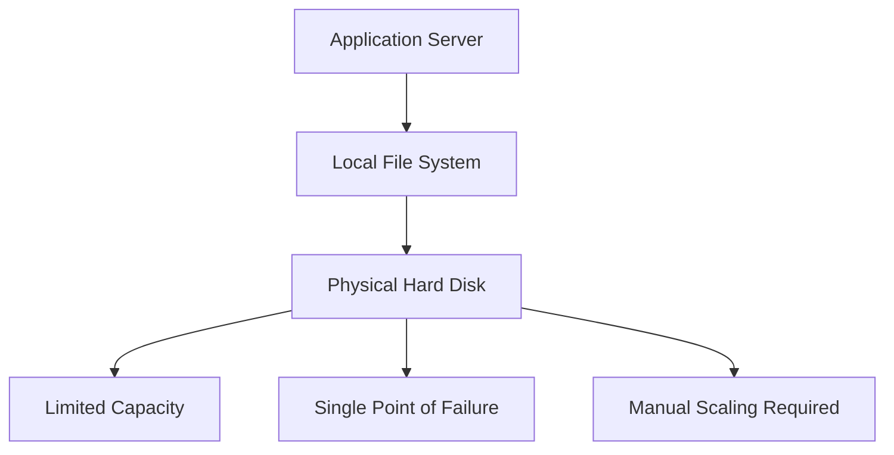
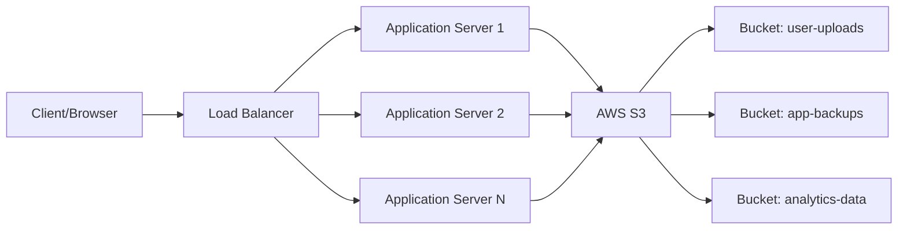
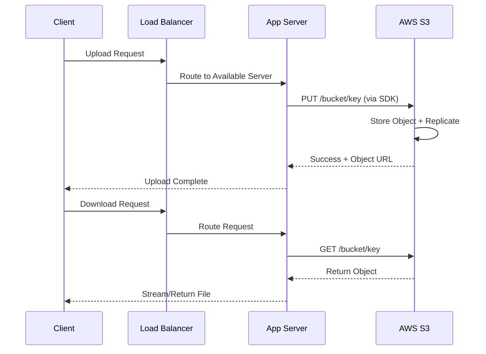
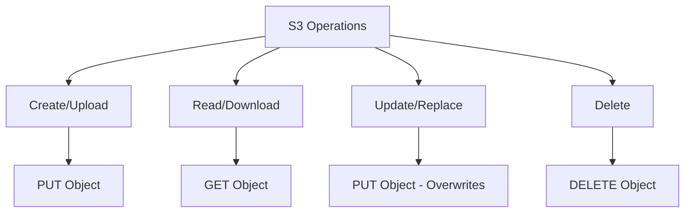
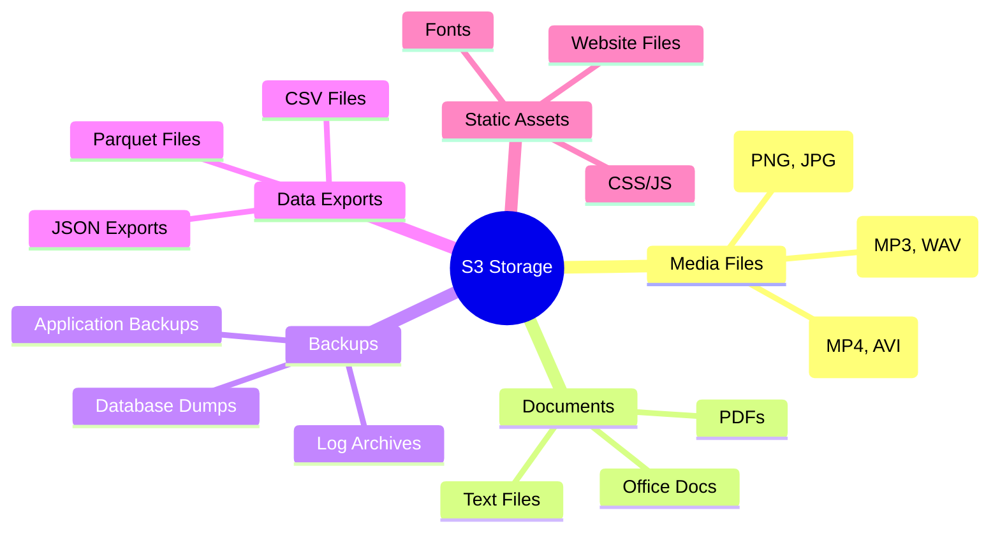
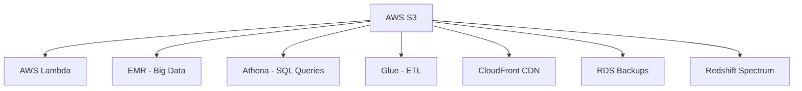
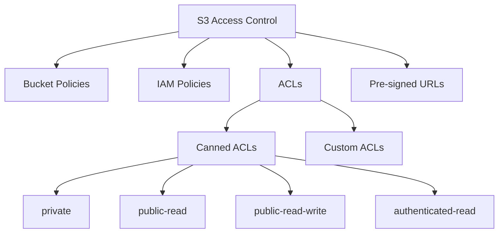
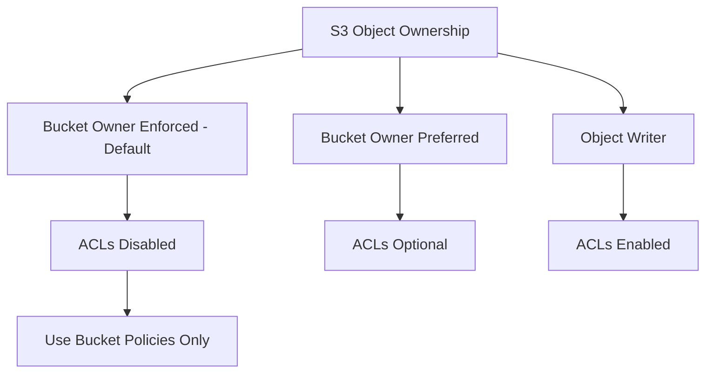
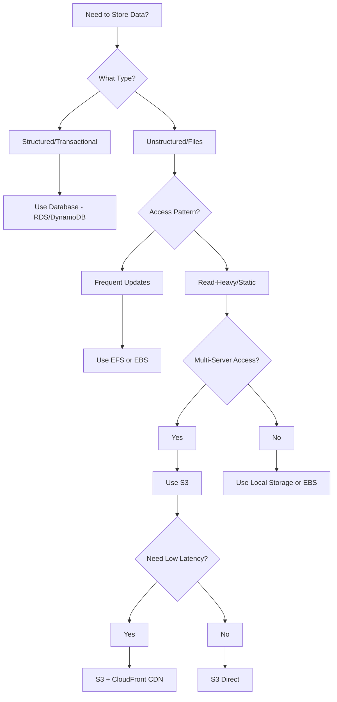

# Blob Storage & AWS S3 - System Design Guide

## What is BLOB?

**BLOB = Binary Large Object**

A BLOB is a collection of binary data stored as a single entity, typically for storing unstructured data like images, videos, audio files, and documents.

## Why Use Blob Storage?

- **Unstructured Data**: Perfect for non-tabular data (images, videos, backups)
- **Scalability**: Handle petabytes of data without managing infrastructure
- **Durability**: Built-in redundancy and replication
- **Cost-Effective**: Pay only for what you use
- **Global Accessibility**: Access from anywhere via HTTP/HTTPS

## Evolution: Before Blob Storage

### Traditional Static Hard Disk Storage



**Problems with Traditional Storage:**
- Limited scalability
- Manual disk management
- Single server dependency
- No redundancy by default
- Difficult to share across multiple servers
- Expensive hardware upgrades

## AWS S3 (Simple Storage Service)

### What is S3?

S3 is Amazon's cloud-based object storage service that provides:
- Virtually unlimited storage capacity
- 99.999999999% (11 9's) durability
- 99.99% availability
- Global accessibility
- Pay-as-you-go pricing

### Why S3 Came into Picture?

**Business Problems It Solved:**
1. **Storage Explosion**: Exponential growth of user-generated content
2. **Scaling Challenges**: Traditional storage couldn't keep up
3. **Cost Inefficiency**: Expensive hardware procurement and maintenance
4. **Global Access**: Need for worldwide content delivery
5. **Backup & Recovery**: Reliable disaster recovery solutions

## S3 Architecture Flow



### Detailed Request Flow



## S3 Core Concepts

### Buckets

- **Container** for objects (like folders but at top level)
- **Globally Unique Name**: No two buckets worldwide can have same name
- **Region-Specific**: Created in specific AWS region
- **Flat Structure**: No actual folder hierarchy (simulated with prefixes)

**Example Bucket Names:**
- `myapp-user-uploads-prod`
- `company-backup-2024`
- `analytics-logs-us-east`

### Keys (Object Identifiers)

The full path to an object within a bucket:

```
bucket-name/folder1/folder2/filename.ext
           └─────────────┬─────────────┘
                       Key
```

**Examples:**
- Key: `images/users/12345/profile.jpg`
- Key: `backups/database/2024-01-01.sql`
- Key: `videos/tutorials/intro.mp4`

## S3 Operations

### Seamless File Operations



**Key Features:**
- ✅ Atomic operations (create, read, update, delete)
- ✅ Versioning support (optional)
- ✅ Metadata storage
- ✅ Server-side encryption
- ❌ **Not a full-fledged file system** (no POSIX operations like append, chmod)

## What Can You Store in S3?

### Data Types



### Common Use Cases
- User-generated content (profile pictures, uploads)
- Video streaming platforms
- Database backups and exports
- Big data analytics (data lakes)
- Static website hosting
- Software distribution (installers, packages)
- Machine learning datasets

## S3 Key Features

### Scalability
- **Unlimited Storage**: No capacity planning needed
- **Auto-scaling**: Handles any request volume
- **Parallel Processing**: High throughput for concurrent requests

### Availability
- **Multi-AZ Replication**: Data stored across multiple availability zones
- **SLA**: 99.99% availability guarantee
- **Automatic Failover**: Seamless handling of infrastructure issues

### Integration with AWS Services



### Big Data Integration
- **Data Lakes**: Central repository for structured/unstructured data
- **Apache Spark/Hadoop**: Direct S3 access
- **Analytics Tools**: Query data directly (Athena, Redshift Spectrum)
- **Machine Learning**: Training data storage for SageMaker

## Disadvantages of S3

### 1. Slow Reads for Small Files
- **Latency**: Network round-trip for each request (~100ms)
- **Solution**: Use caching (CloudFront CDN, Redis)

### 2. Not a Traditional File System
- No in-place updates (must replace entire object)
- No append operations
- No file locking mechanisms
- No POSIX compliance

### 3. Eventual Consistency (for overwrite/delete)
- New objects: Read-after-write consistency
- Overwrites/Deletes: Eventual consistency
- Can briefly see old version after update

### 4. Cost Considerations
- **GET Requests**: Frequent reads can be expensive
- **Data Transfer**: Egress charges for downloads
- **Storage Classes**: Need to choose appropriate tier

### 5. Requires AWS SDK
- Can't mount as local file system easily
- Need API integration in code
- Learning curve for developers

### 6. No Partial Updates
- Must download, modify, and re-upload entire object
- Inefficient for large files with small changes

## When to Use S3

### ✅ Perfect For:

1. **Centrally Accessible Blob Storage**
   - Multiple servers need access to same files
   - Microservices architecture
   - Multi-region deployments

2. **Static Asset Storage**
   - Images, videos, documents
   - Website static files
   - User uploads

3. **Backup & Archive**
   - Database backups
   - Log file archives
   - Disaster recovery

4. **Data Lakes**
   - Big data analytics
   - Machine learning datasets
   - Historical data storage

5. **Content Distribution**
   - With CloudFront CDN
   - Global content delivery
   - Media streaming

6. **Data Sharing**
   - Between applications
   - Between teams
   - With external partners (pre-signed URLs)

### ❌ Not Ideal For:

1. **Transactional Databases**
   - Use RDS, DynamoDB instead
   - Need ACID properties

2. **Frequently Modified Files**
   - High update frequency
   - In-place modifications needed

3. **Low-Latency Requirements**
   - Real-time processing
   - < 10ms response times

4. **File System Operations**
   - Need POSIX compliance
   - Directory operations
   - File locking

## AWS S3 SDK & API Documentation

### Official Documentation Resources

#### 1. **AWS S3 Developer Guide**
- **URL**: https://docs.aws.amazon.com/s3/
- **Content**: Comprehensive guide covering all S3 features
- **Key Topics**:
  - Getting started tutorials
  - Best practices
  - Security and access control
  - Performance optimization

#### 2. **AWS SDK for S3**

**Popular SDKs:**

**Python (Boto3)**
```python
import boto3

# Initialize S3 client
s3_client = boto3.client('s3')

# Upload file
s3_client.upload_file('local_file.jpg', 'my-bucket', 'remote_key.jpg')

# Download file
s3_client.download_file('my-bucket', 'remote_key.jpg', 'downloaded_file.jpg')

# List objects
response = s3_client.list_objects_v2(Bucket='my-bucket')
```
- **Docs**: https://boto3.amazonaws.com/v1/documentation/api/latest/reference/services/s3.html

**JavaScript/Node.js (AWS SDK v3)**
```javascript
const { S3Client, PutObjectCommand, GetObjectCommand } = require("@aws-sdk/client-s3");

const client = new S3Client({ region: "us-east-1" });

// Upload
await client.send(new PutObjectCommand({
  Bucket: "my-bucket",
  Key: "file.txt",
  Body: fileContent
}));

// Download
const response = await client.send(new GetObjectCommand({
  Bucket: "my-bucket",
  Key: "file.txt"
}));
```
- **Docs**: https://docs.aws.amazon.com/AWSJavaScriptSDK/v3/latest/client/s3/

**Java (AWS SDK for Java 2.x)**
```java
S3Client s3 = S3Client.builder().region(Region.US_EAST_1).build();

// Upload
s3.putObject(PutObjectRequest.builder()
    .bucket("my-bucket")
    .key("file.txt")
    .build(), 
    RequestBody.fromFile(new File("local_file.txt")));
```
- **Docs**: https://docs.aws.amazon.com/sdk-for-java/latest/developer-guide/examples-s3.html

#### 3. **REST API Reference**
- **URL**: https://docs.aws.amazon.com/AmazonS3/latest/API/Welcome.html
- **Key Operations**:
  - `PUT /bucket/key` - Upload object
  - `GET /bucket/key` - Download object
  - `DELETE /bucket/key` - Delete object
  - `HEAD /bucket/key` - Get object metadata
  - `POST /bucket?uploads` - Multipart upload

#### 4. **AWS CLI Commands**
```bash
# Upload file
aws s3 cp local_file.txt s3://my-bucket/remote_file.txt

# Download file
aws s3 cp s3://my-bucket/remote_file.txt local_file.txt

# Sync directory
aws s3 sync ./local-folder s3://my-bucket/folder/

# List objects
aws s3 ls s3://my-bucket/
```
- **Docs**: https://docs.aws.amazon.com/cli/latest/reference/s3/

#### 5. **Code Examples & Tutorials**
- **AWS Code Examples Repository**: https://github.com/awsdocs/aws-doc-sdk-examples
- **Interactive Tutorials**: AWS Training and Certification portal
- **Sample Projects**: https://github.com/aws-samples/

## Access Control Lists (ACLs) on S3

### What are ACLs?

**Access Control Lists** define who can access your S3 objects and what permissions they have. They provide **object-level** and **bucket-level** access control.



### ACL Permission Types

| Permission | Bucket Level | Object Level |
|-----------|-------------|--------------|
| **READ** | List objects | Read object data |
| **WRITE** | Create/delete objects | Not applicable |
| **READ_ACP** | Read bucket ACL | Read object ACL |
| **WRITE_ACP** | Write bucket ACL | Write object ACL |
| **FULL_CONTROL** | All permissions | All permissions |

### Canned ACLs (Predefined)

**Most Common:**

1. **private** (default)
   - Only owner has FULL_CONTROL
   - Others have no access

2. **public-read**
   - Owner has FULL_CONTROL
   - Everyone can READ
   - Use case: Public website assets

3. **public-read-write**
   - Owner has FULL_CONTROL
   - Everyone can READ and WRITE
   - ⚠️ **Dangerous**: Avoid in production

4. **authenticated-read**
   - Owner has FULL_CONTROL
   - Any AWS authenticated user can READ

5. **bucket-owner-full-control**
   - Object owner and bucket owner have FULL_CONTROL
   - Use case: Cross-account uploads

### Setting ACLs via SDK

**Python (Boto3)**
```python
import boto3

s3 = boto3.client('s3')

# Upload with canned ACL
s3.put_object(
    Bucket='my-bucket',
    Key='public-image.jpg',
    Body=image_data,
    ACL='public-read'  # Canned ACL
)

# Set ACL on existing object
s3.put_object_acl(
    Bucket='my-bucket',
    Key='file.txt',
    ACL='private'
)

# Custom ACL (Grantee-based)
s3.put_object_acl(
    Bucket='my-bucket',
    Key='shared-doc.pdf',
    AccessControlPolicy={
        'Grants': [
            {
                'Grantee': {
                    'Type': 'CanonicalUser',
                    'ID': 'user-canonical-id'
                },
                'Permission': 'READ'
            },
        ],
        'Owner': {
            'ID': 'owner-canonical-id'
        }
    }
)
```

**AWS CLI**
```bash
# Upload with public-read ACL
aws s3 cp file.txt s3://my-bucket/ --acl public-read

# Change ACL on existing object
aws s3api put-object-acl --bucket my-bucket --key file.txt --acl private

# Grant specific user read access
aws s3api put-object-acl \
  --bucket my-bucket \
  --key file.txt \
  --grant-read emailaddress=user@example.com
```

### ACL Use Cases & Best Practices

#### When to Use ACLs:
1. **Simple Public Access**: Making specific objects publicly readable
2. **Cross-Account Access**: Granting bucket owner control over uploaded objects
3. **Legacy Systems**: Supporting older applications

#### Modern Alternatives (Recommended):

**1. Bucket Policies** (Preferred for most cases)
```json
{
  "Version": "2012-10-17",
  "Statement": [
    {
      "Sid": "PublicReadGetObject",
      "Effect": "Allow",
      "Principal": "*",
      "Action": "s3:GetObject",
      "Resource": "arn:aws:s3:::my-bucket/public/*"
    }
  ]
}
```

**2. IAM Policies** (For AWS user/role access)
```json
{
  "Version": "2012-10-17",
  "Statement": [
    {
      "Effect": "Allow",
      "Action": ["s3:GetObject", "s3:PutObject"],
      "Resource": "arn:aws:s3:::my-bucket/*"
    }
  ]
}
```

**3. Pre-signed URLs** (Temporary access)
```python
url = s3_client.generate_presigned_url(
    'get_object',
    Params={'Bucket': 'my-bucket', 'Key': 'file.txt'},
    ExpiresIn=3600  # 1 hour
)
```

### ACL Security Considerations

#### ⚠️ Warning: ACLs Disabled by Default (New Feature)

As of **April 2023**, AWS introduced **S3 Object Ownership** with default setting: **"Bucket owner enforced"**



**Implications:**
- ACLs are **disabled** for new buckets by default
- All objects owned by bucket owner
- Simplifies permissions management
- Recommended approach: Use **bucket policies** instead

#### Enabling ACLs (If Needed)
```bash
aws s3api put-bucket-ownership-controls \
  --bucket my-bucket \
  --ownership-controls Rules=[{ObjectOwnership=ObjectWriter}]
```

### ACL vs Bucket Policy vs IAM Policy

| Feature | ACLs | Bucket Policies | IAM Policies |
|---------|------|----------------|--------------|
| **Granularity** | Object/Bucket | Bucket + Prefix | User/Role |
| **Complexity** | Simple | Medium | Complex |
| **Cross-Account** | Yes | Yes | Limited |
| **Conditions** | No | Yes (IP, time, etc.) | Yes |
| **Recommendation** | Legacy only | ✅ Preferred | For AWS identities |

### ACL Best Practices

1. **Default to Bucket Policies**: More powerful and flexible
2. **Keep Objects Private**: Use `private` ACL by default
3. **Use Pre-signed URLs**: For temporary public access
4. **Avoid public-read-write**: Major security risk
5. **Regular Audits**: Check for unintended public access
6. **Enable S3 Block Public Access**: Account-level protection

### Further ACL Resources

- **S3 ACL Overview**: https://docs.aws.amazon.com/AmazonS3/latest/userguide/acl-overview.html
- **Canned ACL Reference**: https://docs.aws.amazon.com/AmazonS3/latest/userguide/acl-overview.html#canned-acl
- **Object Ownership**: https://docs.aws.amazon.com/AmazonS3/latest/userguide/about-object-ownership.html
- **Security Best Practices**: https://docs.aws.amazon.com/AmazonS3/latest/userguide/security-best-practices.html

---

## Summary Decision Tree



---

*This guide covers core S3 concepts for system design interviews. For production implementations, always refer to official AWS documentation for latest features and best practices.*