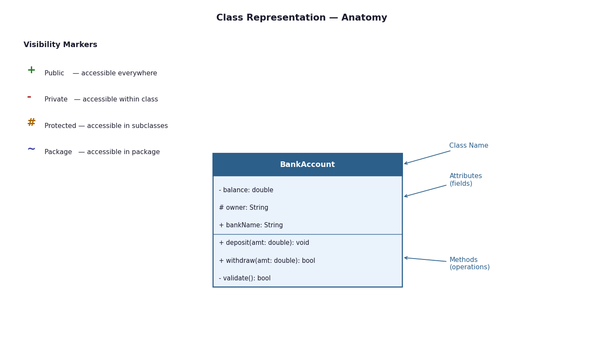
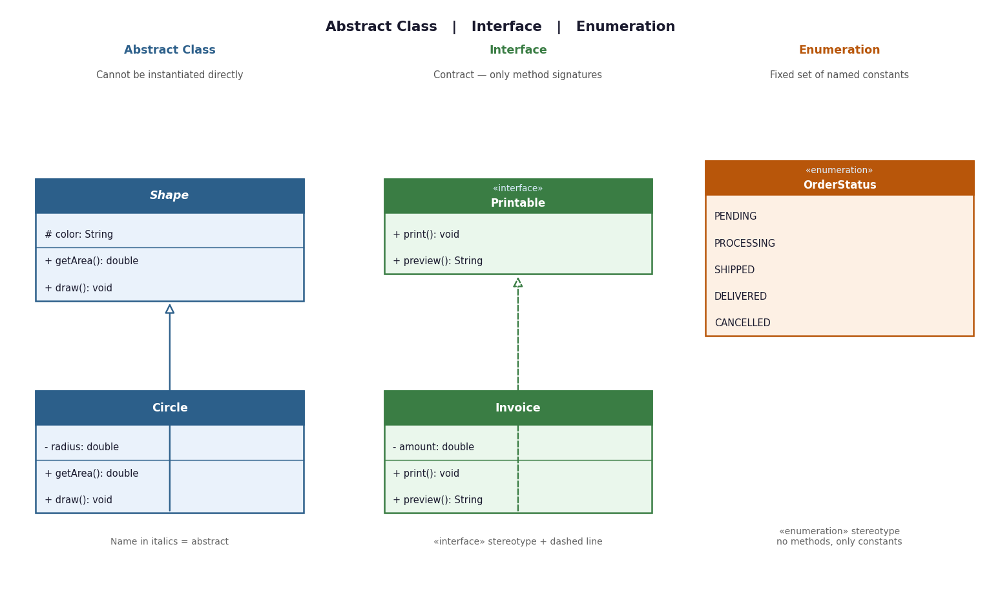
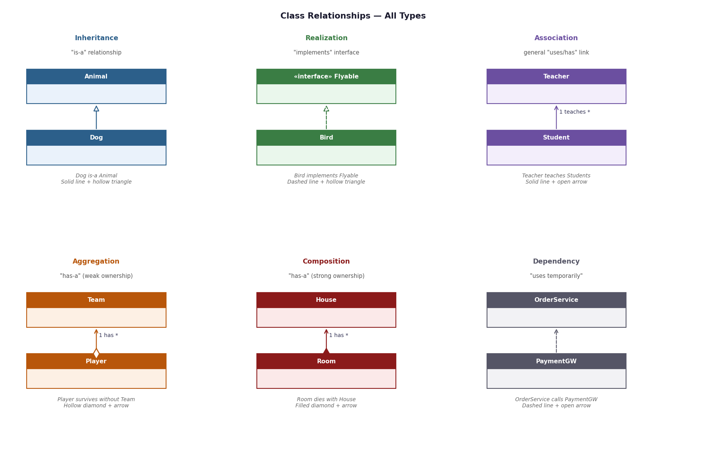
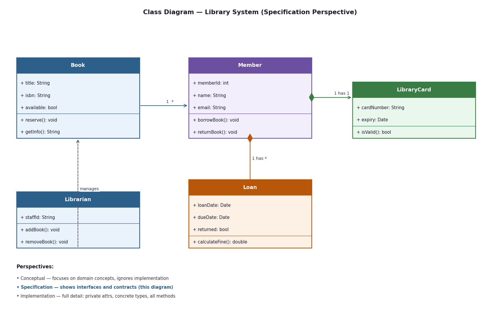

# UML Diagrams

---

## What is UML?

**Unified Modeling Language (UML)** is a standardized visual language used to design, document, and communicate the structure and behavior of software systems. It is not a programming language — it's a blueprint tool used by developers, architects, and teams to think through a system before (or while) building it.

---

## Types of UML Diagrams

UML diagrams fall into two broad categories:

**Structural Diagrams** — describe *what* the system is made of:
- Class Diagram, Object Diagram, Component Diagram, Deployment Diagram, Package Diagram

**Behavioral Diagrams** — describe *what* the system does:
- Use Case Diagram, Sequence Diagram, Activity Diagram, State Machine Diagram, Communication Diagram

> The **Class Diagram** is the most widely used and is the foundation of object-oriented design.

---

---

# Class-Based UML Diagrams

A **class diagram** shows the static structure of a system — the classes, their attributes, methods, and the relationships between them.

---

## Class Representation

A class is drawn as a rectangle divided into three sections: the **name** at the top, **attributes** in the middle, and **methods** at the bottom.



---

## Visibility Markers

Every attribute and method has a visibility prefix:

| Symbol | Visibility | Meaning |
|---|---|---|
| `+` | Public | Accessible from anywhere |
| `-` | Private | Accessible only within the class |
| `#` | Protected | Accessible within the class and its subclasses |
| `~` | Package | Accessible within the same package |

---

## Attribute and Method Syntax

**Attributes:**
```
visibility name: Type = defaultValue
- balance: double = 0.0
+ name: String
```

**Methods:**
```
visibility name(paramName: Type): ReturnType
+ deposit(amount: double): void
- validate(): bool
```

- Parameters are inside parentheses
- Return type comes after the colon
- Static members are shown **underlined**
- Abstract methods are shown in *italics*

---

## Abstract Classes, Interfaces & Enumerations



**Abstract Class**
- Cannot be instantiated directly
- May have both concrete and abstract methods
- Class name is written in *italics*
- Subclasses must implement all abstract methods

**Interface**
- A pure contract — defines method signatures only, no implementation
- Marked with the `«interface»` stereotype
- A class that implements it shows a **dashed line with hollow triangle** (realization)

**Enumeration**
- A fixed set of named constants
- Marked with the `«enumeration»` stereotype
- No methods, only constant values listed in the attributes section

---

## Perspectives of a Class Diagram

Class diagrams can be drawn at three levels of detail depending on the purpose:

| Perspective | Focus | Used When |
|---|---|---|
| **Conceptual** | Domain concepts and ideas; ignores implementation | Early design, requirements discussion |
| **Specification** | Interfaces, contracts, types; hides internal details | API design, component design |
| **Implementation** | Full detail — private fields, concrete types, all methods | Code-level documentation, code generation |

> In interviews, the **specification perspective** is most commonly expected.

---

## Relationships Between Classes



---

### 1. Inheritance (Generalization)
- **"is-a"** relationship
- Child class extends parent class, inheriting its attributes and methods
- **Notation:** Solid line + hollow triangle pointing to the parent
- **Example:** `Dog` is-a `Animal` — Dog inherits name, age, and makeSound()

---

### 2. Realization (Interface Implementation)
- **"implements"** relationship
- A class fulfills the contract defined by an interface
- **Notation:** Dashed line + hollow triangle pointing to the interface
- **Example:** `Bird` implements `Flyable` — Bird provides a concrete fly() method

---

### 3. Association
- A general **"uses / has a link to"** relationship between two classes
- Can have multiplicity labels (`1`, `*`, `0..1`, `1..*`)
- **Notation:** Solid line with open arrow
- **Example:** `Teacher` teaches `Student` (1 teacher, many students)

---

### 4. Aggregation (Weak "has-a")
- One class contains another, but the contained object **can exist independently**
- **Notation:** Solid line + hollow diamond at the owner's end
- **Example:** `Team` has `Player` — a Player can exist without a Team (e.g., free agent)

---

### 5. Composition (Strong "has-a")
- One class owns another; the contained object **cannot exist without the owner**
- **Notation:** Solid line + filled diamond at the owner's end
- **Example:** `House` has `Room` — destroy the House, Rooms cease to exist

> **Aggregation vs Composition:** Both are "has-a", but composition implies lifecycle ownership.

---

### 6. Dependency
- The weakest relationship — one class **temporarily uses** another (e.g., as a method parameter)
- **Notation:** Dashed line + open arrow
- **Example:** `OrderService` depends on `PaymentGateway` — it calls it but doesn't own it

---

## Full Example — Library System



This diagram shows:
- `Member` has a **composition** relationship with `Loan` and `LibraryCard` — both cease to exist without the member
- `Book` is linked to `Loan` via **association** — a book can have many loans over time
- `Librarian` has a **dependency** on `Book` — it manages books but doesn't own them

---

*UML Class Diagrams — Revision Notes*
